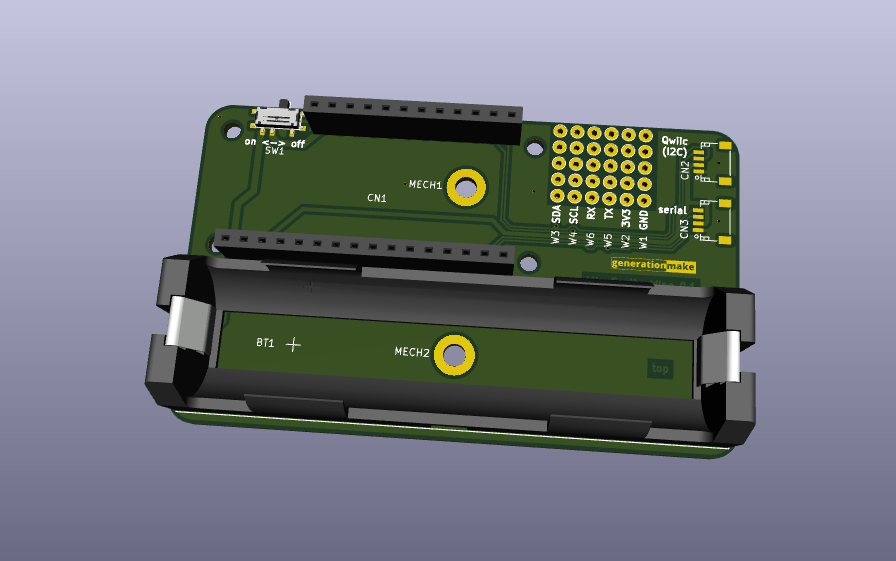
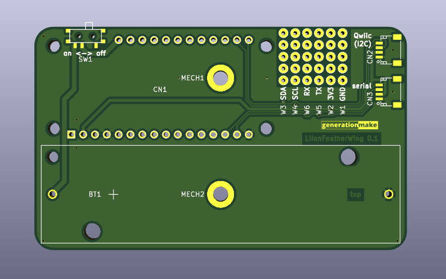
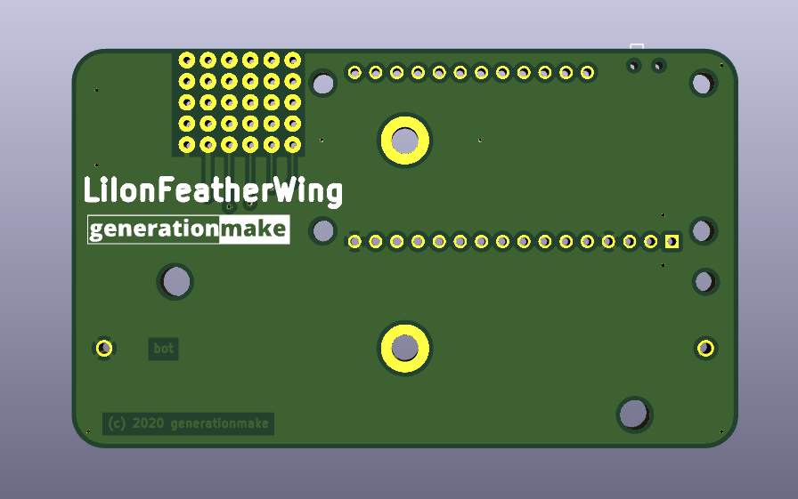
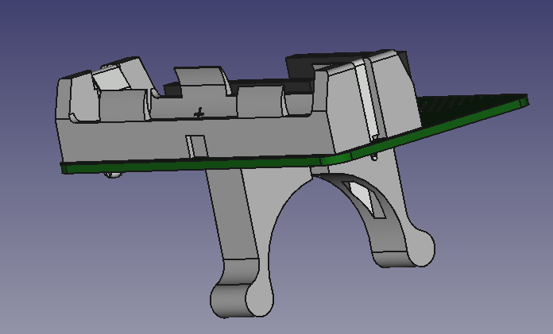

# LiIonFeatherWing
Feather Wing with a 18650 LiIon-battery and various mounting options compatible with Adafruit feather

## PCB

### Top

### Bottom

## Mounting Options

### BikeAdapter

The BikeAdapter needs to be 3D printed and screwed to the LiIonFeatherWing PCB with two M3 screws and nuts. It can be attached to the handlebar using an o-ring.

